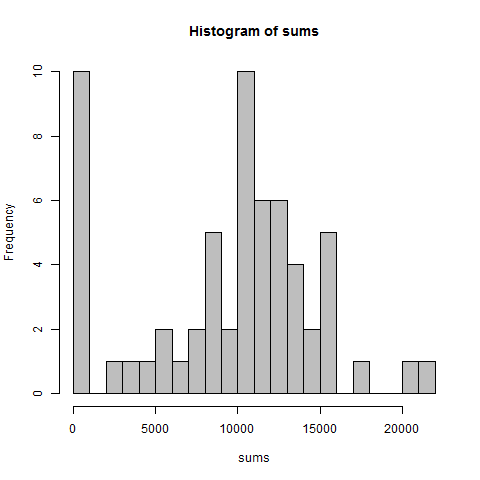
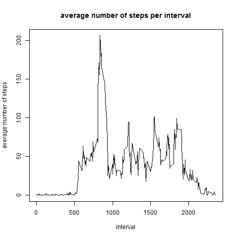
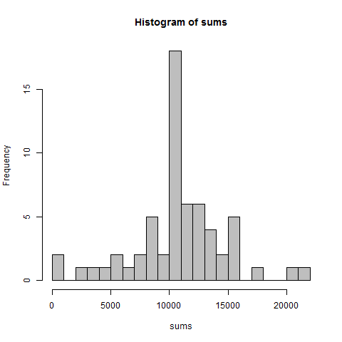
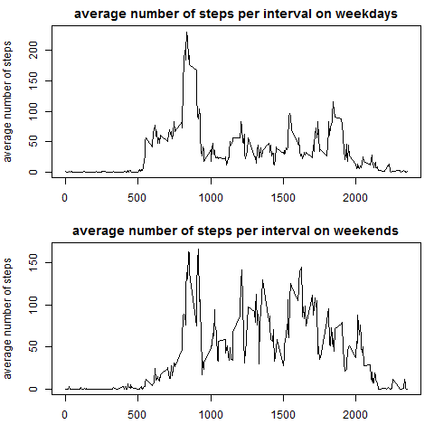

## Loading and preprocessing the data

The data was downloaded from https://d396qusza40orc.cloudfront.net/repdata%2Fdata%2Factivity.zip ,
copied to a working directory and unzipped by 7-Zip (http://www.7-zip.org/ version 15.14 (2015-12-31)). The data was read into R by *read.csv()*:

```{r}
dat <- read.csv("activity.csv", header = T, colClasses=c("numeric", "character", "numeric"))
```
The date was read-in as character and subsequently transformed to "date" format.
```{r}
dat$date <- as.Date(dat$date,format = "%Y-%m-%d")
```

## What is mean total number of steps taken per day?

First, the total number of steps for each day was calculated by *tapply()*:
```{r}
sums <- tapply(dat$steps, dat$date, sum, na.rm=T)
```

A histogram of *sums* was plotted to get an overview of the values:
```{r}
hist(sums, breaks = 20, col="grey")
```

 

To calculate the median and the mean of the steps per day, the summary function was used:
```{r}
summary(sums)

```
The median and mean of numbers per steps was 10400 and 9354 respectively.


## What is the average daily activity pattern?

The average number of steps for each interval was calculated by *aggregate()*. 
The resulting data frame *av* contained the interval number and the average for each interval. These results were plotted as a time series.
```{r}
av <- aggregate(dat$steps, by=list(interval=dat$interval), FUN=mean, na.rm=TRUE)

plot(av$interval, av$x, type="l", xlab="interval", ylab="average number of steps", 
     main="average number of steps per interval")
```
 

The maximum number of steps was identified by *which.max()*.
```{r}
av[which.max(av$x),]
```
The maximum number of steps was found in interval 835 with 206.2 steps.


## Imputing missing values

The number of missing values was estimated by *is.na()* and *table()*
```{r}
table(is.na(dat$steps))
```
There are 2304 missing values for *steps*.


The missing values were replaced by the means of the respective interval (stored 
in *av*). A for loop was used to achive the replacement:
```{r}
dat.filled <- dat
for (i in 1:length(dat$steps)){
    if (is.na(dat.filled$steps[i])){
        dat.filled$steps[i] <- av$x[which(av$interval == dat.filled$interval[i])]
    }
}
```
The resulting data.frame *dat.filled* contained the data from *dat* but all NAs
were replaced with the respective average of the interval.


Steps per day were recalculated the for the new data with imputed NAs:
```{r}
sums <- tapply(dat.filled$steps, dat.filled$date, sum)
hist(sums, breaks = 20, col="grey")

summary(sums)
```
 

Mean and median values were higher after imputing NAs. There were some days 
without any step values in the original data and these were replaced by the 
interval means, thus the total number of steps increased.

## Are there differences in activity patterns between weekdays and weekends?

Weekdays were identified with the function *weekdays()* and subsequently classified 
as weekend (== "Sunday" | == "Saturday") or weekdays (all other days). The new factor 
column was saved in *dat.filled$weekday*.
```{r}
dat.filled$weekday <- weekdays(dat.filled$date)

for (i in 1:length(dat.filled$weekday)){
    if (dat.filled$weekday[i] == "Sonntag" | dat.filled$weekday[i] == "Samstag"){
        dat.filled$weekday[i] <- "weekend"
    }else{
        dat.filled$weekday[i] <- "weekday"
    }
}
dat.filled$weekday <- as.factor(dat.filled$weekday)

```

The averages for the intervals were recalculated by *aggregate()* but this time 
the data was split in weekend and weekday by the factor column *dat.filled$weekday*.
The results were plotted in a panel plot.
```{r}
av <- aggregate(steps ~ interval + weekday, data=dat.filled, mean)

par(mfrow=c(2,1), mar=c(3,4,2,1))
plot(subset(av, av$weekday=="weekday")$interval , subset(av, av$weekday=="weekday")$steps, 
     type="l", xlab="interval", ylab="average number of steps", 
     main="average number of steps per interval on weekdays")
plot(subset(av, av$weekday=="weekend")$interval , subset(av, av$weekday=="weekend")$steps, 
     type="l", xlab="interval", ylab="average number of steps", 
     main="average number of steps per interval on weekends")
```
 

